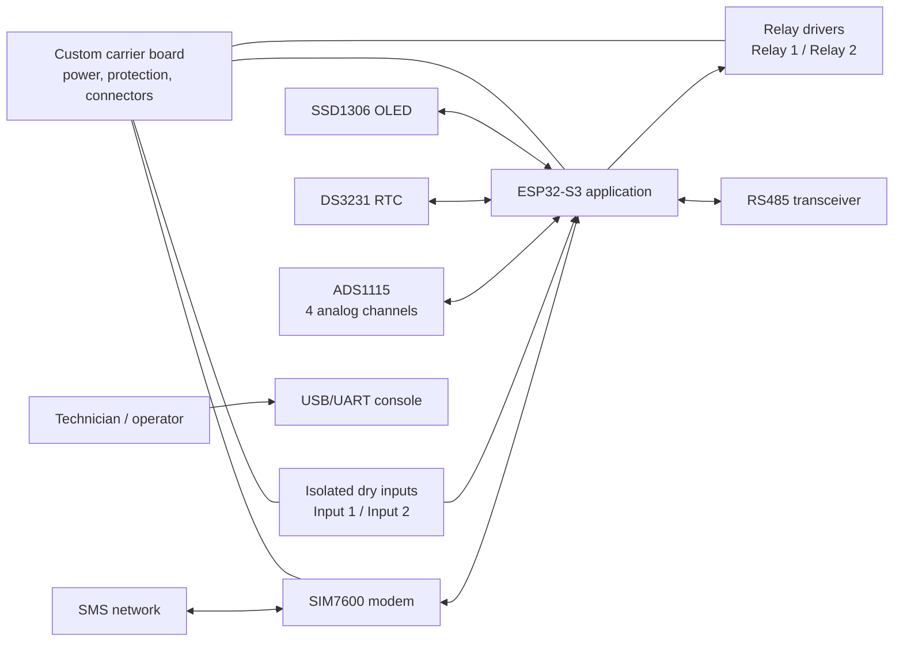
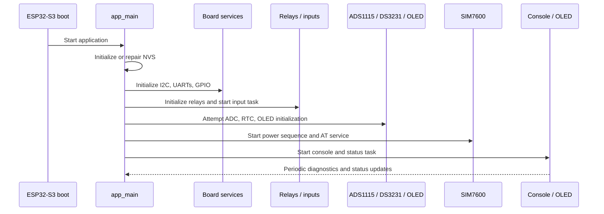

# ESP32-S3 SIM7600 Controller — System Architecture

## 1. Purpose and scope

This document describes the architecture of the original ESP-IDF firmware in this repository. The firmware is a reference implementation for an ESP32-S3 controller with two relay outputs, two dry-contact inputs, ADS1115 analog acquisition, a SIM7600 cellular modem, RS485, an SSD1306 display, and a DS3231 real-time clock. Its feature set is inspired by the publicly described KinCony B2 controller, but the source code and board profile are independent and do not claim to reproduce the commercial product schematic [1] [2].

The architecture favors explicit C code, ESP-IDF driver APIs, FreeRTOS tasks, and small subsystem interfaces. This makes the project suitable for a custom carrier board, laboratory prototype, or starting point for a production firmware review. It is not a mains-wiring design, a certified safety controller, or a complete cellular IoT product. Hardware protection, electrical isolation, antenna design, enclosure safety, secure provisioning, and regulatory approval remain system-level responsibilities.

## 2. System context

The firmware runs on an ESP32-S3 using the native ESP-IDF build system. The controller acts as a local I/O coordinator: it samples inputs, controls relays, polls attached peripherals, exposes a local serial console, and uses the SIM7600 UART to receive SMS commands and issue modem operations. The current application does not establish a packet-data PPP/IP session; the modem interface is intentionally limited to AT transport, registration/status queries, SMS, and voice-call control [3].

## 3. Hardware abstraction and example profile

All board-specific routing is centralized in `main/b2_config.c` and exposed through `main/include/b2_config.h`. The profile below is an example used to make the firmware build and to provide a clear adaptation point. It is not a verified KinCony B2 pinout. Replace it after reviewing the schematic of the target carrier board [4].

| Function | Example assignment | Firmware use | Required hardware review |
|---|---:|---|---|
| Relay 1 / Relay 2 | GPIO4 / GPIO5 | Digital outputs with safe startup and active-polarity handling | Confirm driver input levels, reset state, coil isolation, and contact ratings. |
| Dry input 1 / Dry input 2 | GPIO6 / GPIO7 | Debounced digital inputs | Confirm isolation, pull-up/down arrangement, active polarity, and field voltage. |
| One-Wire 1–4 | GPIO8–GPIO11 | Reserved in the profile; no One-Wire driver is currently enabled | Confirm pull-up voltage and future bus topology before enabling a driver. |
| Modem power / reset / ring | GPIO12 / GPIO13 / GPIO14 | SIM7600 power sequencing, reset, and ring indication | Confirm polarity, pulse timing, level shifting, and modem carrier behavior. |
| SIM7600 UART1 TX/RX | GPIO17 / GPIO18 | Native ESP-IDF UART AT transport | Confirm logic levels, cross-over, grounding, baud rate, and optional flow control. |
| RS485 UART2 TX/RX/RTS | GPIO15 / GPIO16 / GPIO21 | UART with half-duplex direction control | Confirm DE/RE polarity, termination, biasing, isolation, and connector wiring. |
| Shared I2C SDA/SCL | GPIO38 / GPIO39 | ADS1115, DS3231, and SSD1306 | Confirm pull-ups, bus voltage, addresses, and bus capacitance. |
| SD/SPI reservation | GPIO34–GPIO37 | Pin reservation only; SD mounting is not enabled | Confirm voltage translation, chip-select behavior, and conflict-free routing. |
| Boot/configuration controls | GPIO0 / GPIO45 / GPIO46 | ESP32-S3 boot/configuration reservations | Do not attach uncontrolled external drivers to boot-strapping pins. |

The configuration validator rejects null configurations, invalid relay/input/I2C/UART pins, and relay assignments that collide with reserved boot pins. It does not prove that a PCB is electrically safe or that two peripheral devices do not conflict at runtime; those checks require the target schematic and hardware tests [4].

## 4. Software layers

The project is organized as one ESP-IDF `main` component. The application layer is intentionally thin, while peripheral logic is kept in subsystem modules with small headers.

| Layer | Files | Responsibility |
|---|---|---|
| Application orchestration | `main/app_main.c` | Initializes NVS, networking primitives, board buses, relays, inputs, ADC, RTC, OLED, modem, console, and status task. |
| Board initialization | `main/b2_board.c`, `main/include/b2_board.h` | Configures GPIO, I2C, modem UART, and RS485 UART from the board profile. |
| Board configuration | `main/b2_config.c`, `main/include/b2_config.h` | Defines the example pin map, electrical polarity flags, I2C frequency, and SPI reservations. |
| Relay service | `main/b2_relay.c`, `main/include/b2_relay.h` | Provides mutex-protected set, toggle, and read operations with de-energized initialization. |
| Input service | `main/b2_inputs.c`, `main/include/b2_inputs.h` | Samples dry inputs, applies debounce timing, and invokes the application callback on changes. |
| Analog service | `main/b2_adc.c`, `main/include/b2_adc.h` | Performs ADS1115 single-shot reads and exposes voltage and 4–20 mA helper conversions. |
| Time service | `main/b2_rtc.c`, `main/include/b2_rtc.h` | Reads and writes DS3231 time using BCD conversion over I2C. |
| Display service | `main/b2_oled.c`, `main/include/b2_oled.h` | Sends a small four-line status view to an SSD1306 over I2C. |
| Cellular service | `main/b2_modem.c`, `main/include/b2_modem.h` | Controls the SIM7600 UART, power/reset sequence, AT commands, SMS parsing/sending, dialing, hang-up, and status queries. |
| Local diagnostics | `main/b2_console.c`, `main/include/b2_console.h` | Reads monitor stdin and exposes relay, input, ADC, modem, and help commands. |

The project intentionally uses ESP-IDF and C standard interfaces rather than Arduino, PlatformIO, or MicroPython. The component dependency declaration is in `main/CMakeLists.txt`, and the target/build metadata is in the root `CMakeLists.txt`, `sdkconfig.defaults`, and `partitions.csv` [5].

## 5. Startup sequence

At boot, `app_main()` initializes NVS and repairs an incompatible or exhausted NVS partition by erasing and reinitializing it. It then initializes the ESP-IDF network interface and default event loop, followed by board buses and GPIO. Relay outputs are initialized before the remaining services so the safe startup state is established early.

The dry-input task is started next. ADS1115, DS3231, and SSD1306 initialization failures are logged as warnings and do not stop the application. The same continuation behavior is used for SIM7600 startup: a missing modem leaves the local controller available while the modem service reports a warning. Finally, the console and five-second OLED/status refresh task are started, and the application announces that the controller is ready [3].

## 6. Runtime data flows

### 6.1 Relay control

Relay control is exposed through `b2_relay_set()`, `b2_relay_toggle()`, and `b2_relay_get()`. The service holds a FreeRTOS mutex around state changes and maps logical ON/OFF values to the configured active polarity. Both relays are set to the safe de-energized state during initialization. Application code, the local console, and the SMS callback use the same service rather than writing GPIO registers directly [6].

### 6.2 Dry-contact inputs

The input task samples the configured GPIOs and applies a 50 ms debounce interval. A callback reports a logical active/inactive transition to the application, which logs the event. The current application does not automatically change relays in response to inputs; that behavior should be added only after the desired control policy and fail-safe behavior are specified [7].

### 6.3 Analog acquisition

The ADS1115 driver performs single-shot I2C conversions. Channels 1 and 2 are exposed through voltage helpers, while channels 3 and 4 are exposed through 4–20 mA helper conversion functions. These helpers are software conversions, not a substitute for validating the resistor network, gain setting, input protection, common-mode limits, and calibration of the carrier board [8].

### 6.4 Cellular modem

The modem service owns the configured UART and serializes AT commands with a mutex. It performs power/reset sequencing, reads registration and signal status, parses text-mode incoming SMS notifications, sends SMS messages, and supports dialing and hang-up. The application converts SMS bodies to uppercase and accepts `RELAY1` or `RELAY2` commands with `ON`, `OFF`, or `TOGGLE` actions. There is no sender allow-list, message authentication, TLS session, APN persistence, or packet-data protocol in this reference implementation; these are mandatory production hardening items for unattended deployment [3].

### 6.5 Display and diagnostics

The OLED status task refreshes every five seconds with the firmware identity, relay states, modem registration/signal state, and dry-input states. The serial console provides on-demand input, ADC, and modem status. ESP-IDF log messages remain the primary diagnostic record during bring-up.

## 7. Task and synchronization model

The firmware uses FreeRTOS tasks supplied by ESP-IDF. The input task performs debounced sampling, the modem task receives and parses UART data, the console task reads monitor input, and the status task refreshes the OLED. Relay state is protected by a mutex. Modem command transport is serialized so that an asynchronous SMS notification cannot corrupt a foreground AT command transaction [6] [7] [9].

The current design does not implement a global watchdog policy, persistent configuration schema, authenticated remote control, or a coordinated brownout recovery strategy. Those omissions are deliberate boundaries of the reference firmware and should be resolved before field deployment.

## 8. Build, partitioning, and release model

The root project uses ESP-IDF CMake and targets ESP32-S3. The default configuration expects an 8 MB flash device and a custom OTA-capable partition table with NVS, OTA metadata, two application slots, and storage. Always verify the actual flash capacity and partition map for the selected module before flashing [5].

The repository contains two GitHub Actions workflows:

| Workflow | Trigger | Main checks/output |
|---|---|---|
| `.github/workflows/ci.yml` | Pull requests, pushes to `main`, manual dispatch | Python/project validation, workflow validation, ESP-IDF build, firmware artifact and checksum upload. |
| `.github/workflows/release.yml` | Tags matching `vMAJOR.MINOR.PATCH`, manual dispatch | Exact-tag validation, ESP-IDF release build, tarball/checksums, GitHub Release with generated notes. |

The release artifact is a convenience package, not a substitute for verifying the target board, bootloader settings, flash size, antenna installation, and electrical safety.

## 9. Observability and failure handling

| Symptom | Likely boundary | First diagnostic action |
|---|---|---|
| Application does not boot | Power, boot strap, flash configuration, or invalid board profile | Use a current-limited supply, inspect boot logs, and confirm GPIO0/45/46 are not being driven incorrectly. |
| Relay energizes during reset | Carrier polarity or external driver problem | Disconnect load, measure driver input, and confirm the relay service safe-state behavior. |
| OLED is blank | Wrong I2C pins/address, missing pull-ups, or voltage mismatch | Scan the bus with field wiring disconnected and verify the SSD1306 address. |
| ADC values are wrong | Front-end scaling, gain, wiring, or calibration | Verify the ADS1115 address, resistor network, input range, and reference measurements. |
| Modem does not answer `AT` | Supply, UART cross-over, level, baud, or power-key timing | Validate modem supply independently and use the modem command/status path. |
| SMS is received but relay does not change | Message format, parser limitation, sender policy, or relay service | Use the exact command format and inspect the log; add authentication before production. |
| RS485 is silent | DE/RE polarity, termination, baud, or transceiver wiring | Perform a controlled local loopback before connecting field equipment. |

## 10. Production hardening checklist

Before treating this project as a production controller, add and verify signed firmware updates, secure boot/flash-encryption policy where appropriate, authenticated modem commands, sender allow-listing, encrypted credential storage, APN/data-session management, modem failure recovery, brownout and watchdog policy, persistent configuration validation, relay interlocks, event logging, rate limiting, and a controlled provisioning process. Complete electrical, EMC, ESD, surge, thermal, enclosure, antenna, and regulatory reviews for the final hardware.

## References

[1]: https://www.kincony.com/kincony-b2-smart-controller-released.html "KinCony B2 Smart Controller announcement"

[2]: https://www.kincony.com/smart-electrical-distribution-panel-tuya-home-assistant-4ch.html "KinCony controller product overview"

[3]: ../main/app_main.c "Application startup and SMS callback"

[4]: ../main/b2_config.c "Example board configuration and validation"

[5]: ../CMakeLists.txt "ESP-IDF project metadata"

[6]: ../main/b2_relay.c "Relay service implementation"

[7]: ../main/b2_inputs.c "Debounced dry-input service"

[8]: ../main/b2_adc.c "ADS1115 acquisition implementation"

[9]: ../main/b2_modem.c "SIM7600 AT transport implementation"

[10]: https://docs.espressif.com/projects/esp-idf/en/v5.3.2/esp32s3/get-started/index.html "Espressif ESP-IDF ESP32-S3 getting started"
